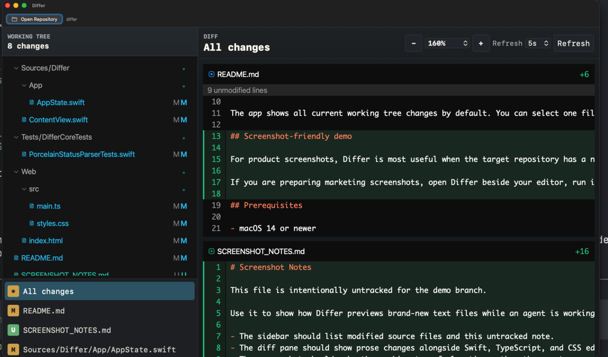

# Differ

Differ is a native macOS app for watching the current state of a Git working tree.

It opens a local repository, polls `git status` and `git diff`, and renders the result in a compact split view with a file tree, a file list, and a diff pane. It is aimed at the "what did the coding agent do?" side of things.



## What it does

Differ is built as a Swift package. The native shell owns the macOS window, repository picker, menu shortcuts, persisted preferences, and Git calls. The diff UI is a bundled TypeScript/Vite web view using `@pierre/diffs` and `@pierre/trees`.

The app shows all current working tree changes by default. You can select one file to focus the diff, hide files from the global **All changes** view while keeping them available for direct selection, pause and resume auto-refresh, adjust the polling interval, and change the UI zoom. Untracked text files are rendered as new-file patches when they are small enough to preview. Large patches are skipped rather than pushed through the web view.

You can select changed lines in the diff and copy either a file/line reference or a reference plus the selected contents as a fenced diff snippet. This is meant for agent-assisted review: instead of describing "that bit in the file", you can paste the exact path, line range, and code into a coding-agent prompt.

## Prerequisites

- macOS 14 or newer
- Xcode command line tools with Swift 6 support
- Node.js and npm
- Git

## Getting started

Clone the repository and install the web dependencies:

```bash
git clone https://github.com/ohnotnow/differ.git
cd differ
npm install
```

Build the web assets before launching the Swift app:

```bash
npm run build:web
swift run Differ .
```

The direct `swift run` command keeps the terminal attached until the app exits. Pass a repository path as the first argument, or omit it and use **Open Repository** in the app.

## Installing the `differ` command

For local development, use the install script:

```bash
./Scripts/install-local
```

It builds the web assets, builds the release Swift executable, installs the app files under `~/.local/share/differ`, and writes a launcher to `~/.local/bin/differ`.

Make sure `~/.local/bin` is on your `PATH`, then run:

```bash
differ .
differ /path/to/repository
```

The launcher creates or updates a lightweight per-repository wrapper app under `~/.local/share/differ/Instances`, named `Differ - <project>`, with its own bundle identifier and the Differ icon. It starts that wrapper in the background, so the shell prompt comes back immediately and macOS can distinguish each project instance in the Dock and app switcher.

You can override the install locations:

```bash
DIFFER_INSTALL_ROOT=/tmp/differ-app DIFFER_BIN_DIR=/tmp/bin ./Scripts/install-local
```

## Development

The web bundle is generated into `Sources/Differ/Resources/Web`, which is ignored by Git apart from its `.gitkeep` placeholder. Rebuild it whenever the TypeScript or CSS changes:

```bash
npm run build:web
```

Run the app from source:

```bash
swift run Differ .
```

Run the Swift test suite:

```bash
swift test
```

## Contributing

Clone the repo, install the Node dependencies, build the web assets, and run `swift test` before opening a pull request. Keep generated build output out of commits.

## Licence

Differ is released under the MIT licence. See [LICENSE](LICENSE).
